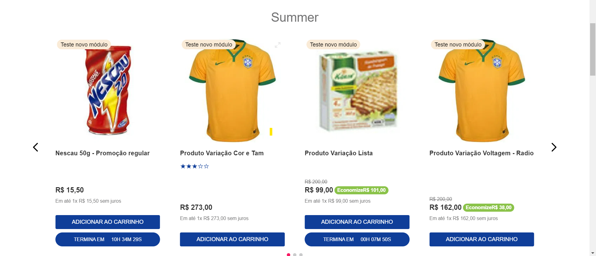

# APP COUNTDOWN ⏲

<!-- DOCS-IGNORE:start -->
<!-- ALL-CONTRIBUTORS-BADGE:START - Do not remove or modify this section -->

<!-- ALL-CONTRIBUTORS-BADGE:END -->
<!-- DOCS-IGNORE:end -->

O componente React consiste em um timer interno que decrementa a cada segundo, atualizando o tempo exibido na prateleira. Ele pode ser configurado para receber uma data de término como propriedade, permitindo que seja facilmente reutilizado para diferentes eventos.

Além disso, o componente React pode ser estilizado de acordo com as necessidades de design da prateleira de e-commerce. Isso inclui a definição de estilos para a div que contém o tempo total do countdown, bem como a personalização de cores, fontes e outros elementos visuais para garantir uma experiência esteticamente agradável e coerente com o restante do site.

Observação: Os componentes não estão estilizados.

## Configurações 

* countdown

1. Crie uma tabela no master data com o Acrônimo `CD` e nome Countdown, além disso criar os campos listados na tabela abaixo.
2. Adicionando o aplicativo como uma dependência de tema no arquivo manifest.json;
3. Declarar o "countdown" nas prateleiras que deseja.

* banner-countdown

1. Adicionar o componente no local desejado.
2. Acessar o site editor.
3. Localizar o N1 - Banner Countdown.
4. Alterar as informações.

### Campos da tabela

| Camp         | Type            | Description                                                                                                             | Display Name    |
| ------------ | --------------- | ----------------------------------------------------------------------------------------------------------------------- | --------------- | 
| `active`     | `boolean`       | Responsavel por ativar o countdown do produto.                                                                          | `ativo?`        |
| `duration`   | `Varchar 100`   | Campo para colocar o tempo da contagem regressiva. Obs: padrão "00:00:00" onde é dividio em hora, minuto e segundo.     | `Duração`       |
| `finalDate`  | `Varchar 100`   | Campo para colocar a data final de funcionamento. Obs: padrão "dd/mm/aaaa hh:mm"                                                                      | `Data Final`    |
| `initialDate`| `Varchar 100`   | Campo para colocar a data inical de funcionamento. Obs: padrão "dd/mm/aaaa hh:mm"                                                                     | `Data Inicial`  |
| `productId`  | `Varchar 100`   | O id do produto que vai receber o countdown.                                                                            | `Id do Produto` |
| `collection` | `Varchar 50` | Campo para colocar o id da coleção | `Coleção` |
### Campos do Banner Countdown no Site editor

| Camp |  Description | Format |
| ---- |  ----------- | ------ |
| Duração do timer | Tempo de duração. | 00:00:00:00 (Dias:Horas:Minutos:Segundos). |
| Título | Nome da promoção, opcional. | Simples texto. |
| Link da promoção | Url para o redirecionamento. | /"nome do link" |
| Data final | Campo para colocar a data final de funcionamento. | 27/11/2020 00:00 (Dia-Mes-Ano Horas:Minutos). |
| Data inicial | Campo para colocar a data inical de funcionamento. | 23/11/2020 08:00 (Dia-Mes-Ano Horas:Minutos). |
| Nome de identificação | Nome para identificar para caso tenha mais de um (Importante colocar). | Home |

## Descrições

* countdown:

Este componente tem a responsabilidade de criar uma contagem regressiva para um produto registrado no master data. A contagem regressiva é armazenada no localStorage, permitindo que ela seja mantida mesmo quando o usuário navega entre as páginas da loja. Esse componente deve ser aplicado aos produtos exibidos nas prateleiras.

Para que esse componente seja renderizado, é necessário que o produto esteja registrado no master data. Além disso, o componente realiza algumas validações antes de exibir a contagem regressiva, como por exemplo:

1. Verificar se o produto está ativo.
2. Verificar se a data atual está dentro do intervalo de funcionamento.
3. Verificar se o ID do produto está registrado no master data.

* banner-countdown:

Este componente tem as mesmas responsabilidades do contador regressivo nos produtos. No entanto, é recomendado que ele seja mais destacado na página do site, em vez de nas prateleiras como na imagem acima. Uma das maiores diferenças reside na forma de alterar o tempo de duração e outras informações. No caso, é possível realizar todas as alterações diretamente no site editor da loja.

## Customização

`Para aplicar personalizações de CSS neste e em outros blocos, siga as instruções fornecidas na receita em [Usando CSS Handles para personalização da loja](https://vtex.io/docs/recipes/style/using-css-handles-for -store-personalização).`

As classes do componente countdown que permitem customização estão listadas na tabela abaixo: 

| CSS Handles |  description |
| ----------- |  ----------- | 
| `countdown__body` | Classe para personalizar o visual do contador regressivo, permitindo a modificação do 'corpo'. Isso possibilita a alteração do background-color e outros elementos visuais. |
| `countdown__text` | Classe para modificar as propriedades da frase "Termina em". Obs: Lembrando que a frase está dentro de um elemento p |
| `countdown__dates` | Classe da Div que contém o tempo total da contagem regressiva. |
| `countdown__date` | Classe para personalizar os tempo (horas, minutos e segundos) |
| `countdown__dots` | Classe para customizar o ":" que divide o tempo entre horas, minutos e segundos |

As classes do componente banner-countdown que permitem customização estão listadas na tabela abaixo:

| CSS Handles |  description |
| ----------- |  ----------- | 
| `banner_countdown__container` | Classe para alterar o container. Adequado para mudar a cor de fundo |
| `banner_countdown__body` | Classe para personalizar o visual do contador regressivo, permitindo a modificação do 'corpo'. Isso possibilita a alteração do background-color e outros elementos visuais. |
| `banner_countdown__text` | Classe para modificar as propriedades da frase "Termina em". Obs: Lembrando que a frase está dentro de um elemento p |
| `banner_countdown__dates` | Classe da Div que contém o tempo total da contagem regressiva. |
| `banner_countdown__date` | Classe para personalizar os tempo (horas, minutos e segundos) |
| `banner_countdown__dots` | Classe para customizar o ":" que divide o tempo entre horas, minutos e segundos |
| `banner_countdown__btn` | Classe para alterar o css do botão que redireciona para o local da promoção. |

Observação: Para estilizar o componente, é recomendado criar um arquivo CSS com o nome "agencian1.countdown" e realizar todas as edições nele.
